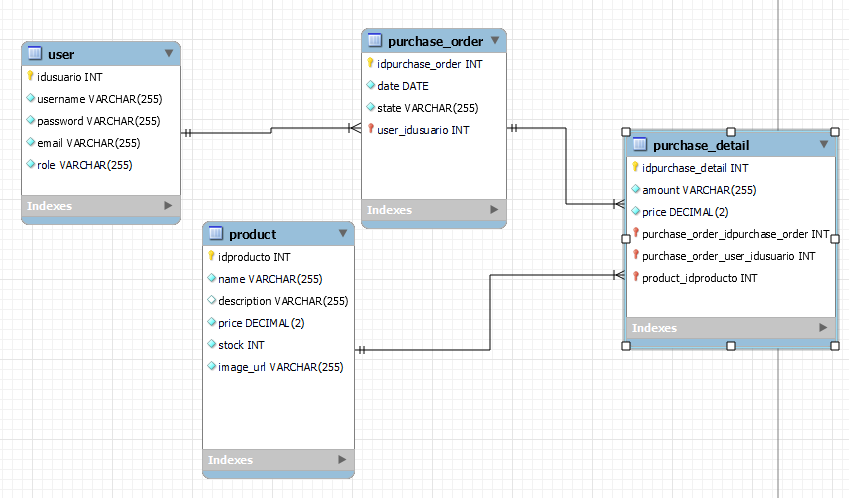

# Proyecto E-commerce

Este es un proyecto para el backend de un e-commerce desarrollado con [NestJS](https://nestjs.com/).

## Descripción

El proyecto consiste en una aplicación de comercio electrónico donde los usuarios pueden registrarse, iniciar sesión, agregar productos al carrito de compras y realizar pedidos. Además, los usuarios administradores tienen acceso a funcionalidades adicionales para administrar productos y pedidos.

## Características

- Registro e inicio de sesión de usuarios.
- Agregar productos al carrito de compras.
- Realizar pedidos.
- Funcionalidades administrativas para usuarios administradores:
  - Actualizar información de productos.
  - Administrar stock.
  - Agregar imágenes de productos mediante un servicio de nube.

## DER



## Instalación

1. Clona este repositorio.

```bash
git clone https://github.com/pi-rym/PM4-Zimmer95.git
```

2. Navega al directorio del proyecto.

```bash
cd PM4-Zimmer95
```

3. Instala las dependencias utilizando npm:

```bash
npm install
```

## Uso

Para ejecutar el servidor:

```bash
npm start
```

## Tecnologías utilizadas

- Node.js
- Express
- PostgreSQL

## Autor

Jorge Zimmermann

## Licencia

Este proyecto está bajo la Licencia MIT. Para más detalles, consulta el archivo [LICENSE](LICENSE).
